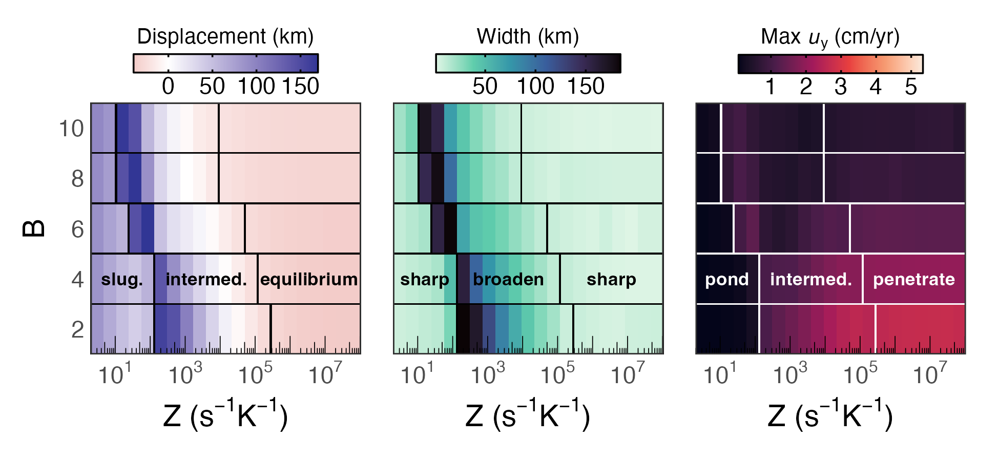

***Figure:*** *Variation in 410 structure and slab descent across kinetic and rheological regimes. Panels show 410 displacement (left), 410 width (middle), and maximum vertical velocity (right) as functions of the kinetic prefactor $`Z`$ (horizontal axis, log scale) and rheological activation factor $`B`$ (vertical axis). Each colored tile represents the measured value within a simulation after 100 Ma, and black/white lines delineate transitions between regime behaviors. The precise location of these transitions depends on $`B`$, where increasing rheological contrast progressively shifts the regime boundaries towards lower $`Z`$ (more sluggish kinetic conditions). Text labels highlight qualitative regimes inferred from the trends.*

# Kerswell et al. (2025; JGR: Solid Earth)

## Repository

This repository provides all materials for the manuscript *Beyond Equilibrium: Kinetic Thresholds and Rheological Feedbacks Control 410 Topography* (Kerswell et al., 2025; submitted to JGR: Solid Earth), including all datasets required to compile the study and scripts to reproduce all results and figures.

## Prerequisite software

### Python

I recommend installing the [miniforge](https://github.com/conda-forge/miniforge) python distribution. This includes a minimal installation of python (plus some dependencies) and the package manager [conda](https://docs.conda.io/en/latest/), which is required to build the necessary python environment for this study.

### R

R is a programming language used to visualize the results in this study. R can be downloaded from the [R Project homepage](https://www.r-project.org). Follow their instructions to install R on your machine.

### Pandoc

Pandoc is a universal document converter used to build a PDF version of the manuscript, which written in Markdown. Pandoc can be downloaded from the [Pandoc homepage](https://pandoc.org). Follow their instructions to install Pandoc on your machine.

## Reproducing the study

The full set of ASPECT solution files and 410 structural measurement dataset can be downloaded from the [Open Science Framework repository](https://osf.io/9phwc/files). The following steps will download all necessary data, reproduce the results and figures, and build a pdf version of the manuscript:

```bash
# Clone this repository
git clone https://github.com/buchanankerswell/kerswell_et_al_410_kinetics.git

# Change into the directory
cd kerswell_et_al_410_kinetics

# Get data and reproduce figures
make build
```

## Coauthors

- [John Wheeler](https://scholar.google.com/citations?user=jsfp2-8AAAAJ&hl=en&oi=ao) (Department of Earth, Oceans and Ecological Sciences, University of Liverpool)
- [Rene Gassmöller](https://scholar.google.com/citations?user=Vk8SmssAAAAJ&hl=en&oi=ao) (GEOMAR Helmholtz Centre for Ocean Research Kiel)
- [J. Huw Davies](https://scholar.google.com/citations?user=T5ygdwcAAAAJ&hl=en&oi=ao) (School of Earth and Environmental Sciences, Cardiff University)

## Acknowledgement

This work was funded by the UKRI NERC Large Grant no. NE/V018477/1. All computations were undertaken on Barkla2, part of the High Performance Computing facilities at the University of Liverpool, who graciously provided expert support. We thank the Computational Infrastructure for Geodynamics ([https://geodynamics.org](https://geodynamics.org)) which is funded by the National Science Foundation under award EAR-0949446 and EAR-1550901 for supporting the development of ASPECT.

## Data Availability

All data, code, and relevant information for reproducing this work can be found at [https://github.com/buchanankerswell/kerswell_et_al_410_kinetics](https://github.com/buchanankerswell/kerswell_et_al_410_kinetics), and at [https://doi.org/10.17605/OSF.IO/9PHWC](https://doi.org/10.17605/OSF.IO/9PHWC), the official Open Science Framework data repository. All code within these repositories is MIT Licensed and free for use and distribution (see license details). ASPECT version 3.0.0, (Bangerth et al., 2024a, 2024b; Clevenger & Heister, 2021; Fraters et al., 2019; Fraters, 2020; Gassmöller et al., 2018; Heister et al., 2017; Kronbichler et al., 2012) used in these computations is freely available under the GPL v2.0 or later license through its software landing page [https://geodynamics.org/resources/aspect](https://geodynamics.org/resources/aspect) or [https://aspect.geodynamics.org](https://aspect.geodynamics.org) and is being actively developed on GitHub and can be accessed via [https://github.com/geodynamics/aspect](https://github.com/geodynamics/aspect).

## Abstract

The seismic expression of Earth's 410 km discontinuity varies substantially across tectonic settings, from sharp, high-amplitude interfaces to broad, diffuse transitions---patterns that cannot be explained by equilibrium thermodynamics without invoking large-scale thermal and/or compositional heterogeneities in the upper mantle. Laboratory experiments demonstrate that the olivine $`\Leftrightarrow`$ wadsleyite phase transition responsible for the 410 is rate-limited, yet previous numerical studies investigating olivine metastability have not directly evaluated the sensitivity of 410 topography to kinetic and rheological factors. Here we systematically investigate these relationships by coupling an interface-controlled growth model to compressible simulations of mantle plumes and subducting slabs. We vary kinetic parameters across seven orders of magnitude and quantify the resulting 410 displacements and widths. Our results reveal a fundamental asymmetry between hot and cold mantle environments. In plumes, high temperatures produce consistently sharp 410s (2–3 km wide) regardless of kinetic or rheological parameters. In slabs, kinetics exert first-order control on 410 structure and flow dynamics through three distinct regimes: (1) quasi-equilibrium behavior at high reaction rates producing narrow, uplifted 410s and continuous slab penetration; (2) intermediate reaction rates generating progressively broader, deeper 410s with metastable olivine wedges that resist but do not prevent slab descent; and (3) ultra-sluggish reaction rates causing complete slab stagnation with re-sharpened but deeply displaced 410s ($`\lesssim`$ 100 km). Strength contrasts further modulate these kinetic effects by controlling slab geometry and residence time in the phase transition zone. These findings demonstrate that reaction rates strongly influence 410 structure in subduction zones and establish the 410 as a potential seismological constraint on kinetic processes operating in Earth’s upper mantle, particularly in cold environments where disequilibrium effects are amplified.

# License

MIT License

Copyright (c) 2024 Buchanan Kerswell

Permission is hereby granted, free of charge, to any person obtaining a copy
of this software and associated documentation files (the "Software"), to deal
in the Software without restriction, including without limitation the rights
to use, copy, modify, merge, publish, distribute, sublicense, and/or sell
copies of the Software, and to permit persons to whom the Software is
furnished to do so, subject to the following conditions:

The above copyright notice and this permission notice shall be included in all
copies or substantial portions of the Software.

THE SOFTWARE IS PROVIDED "AS IS", WITHOUT WARRANTY OF ANY KIND, EXPRESS OR
IMPLIED, INCLUDING BUT NOT LIMITED TO THE WARRANTIES OF MERCHANTABILITY,
FITNESS FOR A PARTICULAR PURPOSE AND NONINFRINGEMENT. IN NO EVENT SHALL THE
AUTHORS OR COPYRIGHT HOLDERS BE LIABLE FOR ANY CLAIM, DAMAGES OR OTHER
LIABILITY, WHETHER IN AN ACTION OF CONTRACT, TORT OR OTHERWISE, ARISING FROM,
OUT OF OR IN CONNECTION WITH THE SOFTWARE OR THE USE OR OTHER DEALINGS IN THE
SOFTWARE.
